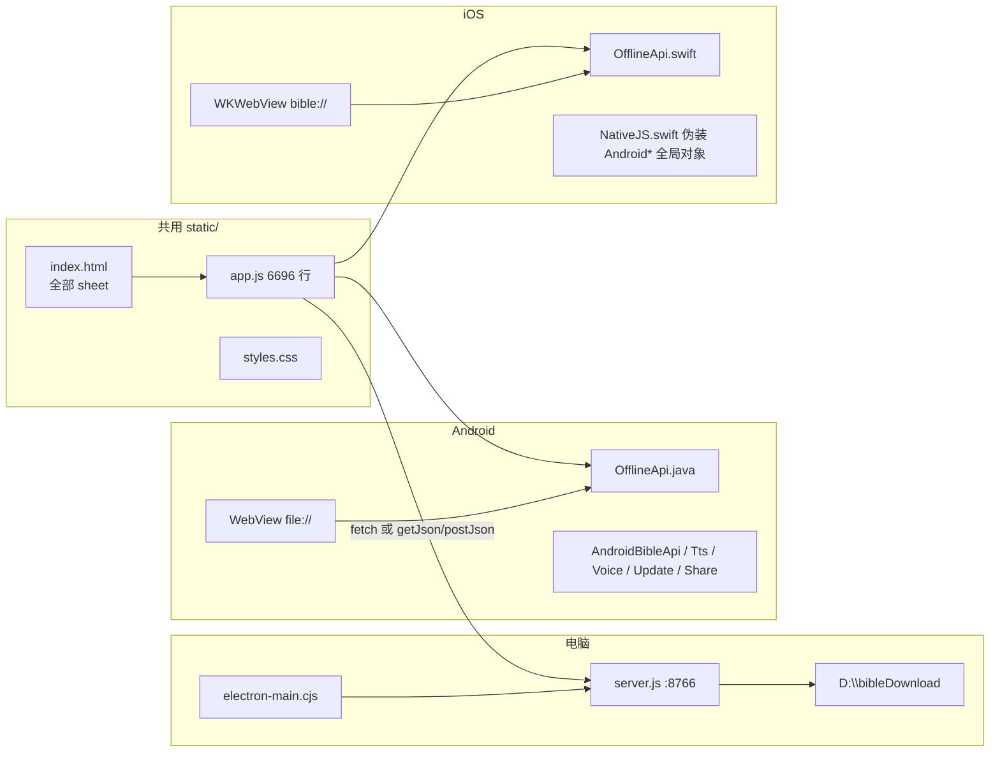
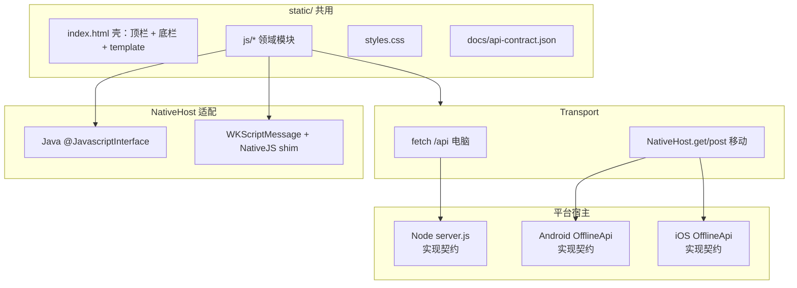
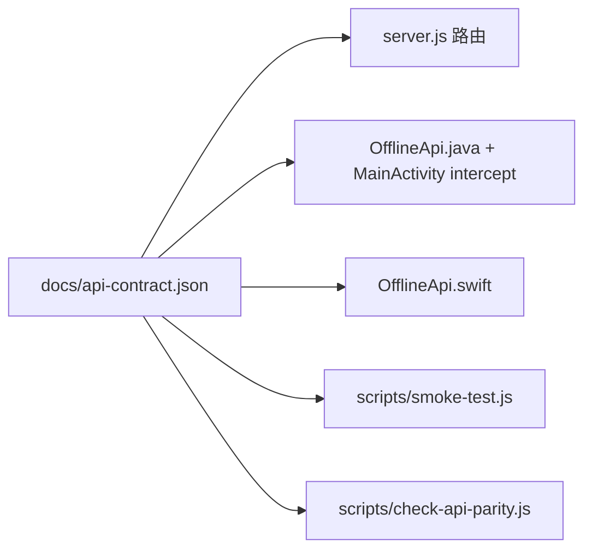
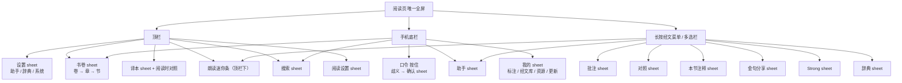
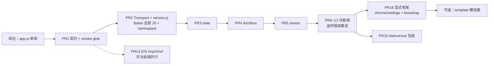

# 本地圣经阅读器重构：架构 · 信息架构 · 可点击原型

| 项 | 内容 |
| --- | --- |
| 作者 | （待填） |
| 日期 | 2026-09-05（修订 2026-09-07） |
| 状态 | Draft |
| 产品拍板 | 用户拍板：全部按推荐（2026-09-05 对话；Open Questions 已关闭） |
| 当前版本 | 1.37.2 |
| 仓库 | https://github.com/cuizihao1992/local-bible-reader-offline |
| 工作目录 | `D:\bible-reader` |
| 可点击原型 | [`docs/prototype/index.html`](prototype/index.html) |

---

## Overview

本地圣经是一套 **共用 `static/` Web UI + 各平台薄壳** 的离线阅读器：电脑走 Node `server.js`（8766）或 Electron 拉起同一后台；Android 用 WebView 加载 `file:///android_asset/static/index.html`，由 `OfflineApi.java` 拦截 `/api/`；iOS 用 WKWebView 自定义 scheme `bible://app/index.html`，由 `OfflineApi.swift` 提供同一套 JSON。经文只来自本机 SQLite；用户标注存在 `user.sqlite`；AI 在 JS 的 `AI_PROVIDERS` 里选云端模型，口令 ASR 走小米。

现状的瓶颈不是功能缺口，而是 **单体膨胀和三端 API 漂移**：`static/app.js` 6696 行、328 个顶层函数，把阅读、搜索、口令、助手、TTS、资源包、更新揉在一起；`static/index.html` 把全部 sheet 堆在一份文档；Android Java 与 iOS Swift 各自手写了一份与 `server.js` 平行的 `/api/`。本次重构 **不换技术栈、不 Flutter、不重写**，用绞杀者（strangler）方式把前端拆模块、把 `/api/` 收成单一契约、把原生桥收成一张表，并固定信息架构：阅读页仍是唯一全屏，其余继续做 sheet。可选本机小模型只预留 **隐藏** runtime 槽（不进设置供应商列表、不进默认 APK）。电脑/Electron 改 `static/` 即生效；Android 发 APK 时 `syncOfflineAssets` 必须用 `babel.android.json`（`targets.android: 8`，`modules: false`）转译 **全部** 随包 JS，不能只转 `app.js`。

---

## Background & Motivation

### 当前形态



| 层 | 路径 | 职责 |
| --- | --- | --- |
| Web UI | `static/index.html` `app.js` `styles.css` | 唯一界面。iOS 由 `scripts/sync-ios-assets.ps1` 拷到 `ios/LocalBible/www/` |
| Node API | `server.js` + `lib/{http,sources,reader,user,books,text,verse-library,webextract}.js` | 电脑/Electron 的 `/api/` 实现 |
| Android 壳 | `android/.../local/bible/reader/` | `MainActivity` 挂 5 个 JS 接口；`OfflineApi` 复制 HTTP 面 |
| iOS 壳 | `ios/LocalBible/` | `SchemeHandler` + `OfflineApi.swift`；`NativeJS.bridge` 把 WK 消息伪装成 Android 同名对象 |
| 桌面壳 | `desktop/electron-main.cjs` | 找端口、spawn `server.js`、打开 BrowserWindow |
| 更新 | GitHub Releases + 根目录 `latest.json` | 应用内 APK 更新；国内 jsDelivr/fastly 回退 |
| Android 资源同步 | `android/app/build.gradle` `syncOfflineAssets` | 拷贝 `static/` 进 APK，再用 `babel.android.json` 转译 JS（今日只转 `app.js`，拆文件后必须转全部） |

数据根：电脑默认 `BIBLE_DATA_ROOT=D:\bibleDownload`；Android 把内置译本拷到 `context.getFilesDir()/bibles`；iOS 拷到 Application Support `LocalBible/`。用户库一律叫 `user.sqlite`，无云账号。

### 痛点（量化）

1. **前端单体**：`static/app.js` 6696 行、328 个顶层函数，从 `STORAGE_KEY` 到 pinch-zoom 全在一个文件；约 213 个 `$("#id")` DOM 绑定、约 172 处 `addEventListener`。`api()` / `loadChapter()` / `runAgent()` / `parseSpokenCommand()` / `checkForUpdates()` 无边界。改口令容易碰到阅读滚动。
2. **HTML 单体**：`index.html` 同时含侧栏三 tab、阅读顶栏、13 个 `.sheetPanel`（再加 `readerSettingsPanel` 与手机上变成 sheet 的 `.sidebar`，合计约 15 个叠层）、经文菜单、多选栏、peek 条、底栏。没有路由，全靠 `hidden` + `body.sheetOpen`。
3. **API 三写**：`server.js` 26 条唯一 `/api/` 路径（29 个含方法分流的 `if`）；`OfflineApi.java` `handle`/`handlePost`；`OfflineApi.swift` `handleGet`/`handlePost`。图片路径在 Android 由 `MainActivity.shouldInterceptRequest` 提供，不在 `OfflineApi.handle`。已知缺口：iOS **没有** `/api/import/url`（现 `handlePost` 已返回错误 JSON，JS `api()` 会 toast，不是静默失败）；Android/iOS `/api/audio` 返回空数组；Node `/api/packages` 的 `installed` 恒为 `false`（已带 `androidOnly: true`）。
4. **原生桥即兴**：JS 直接探测 `window.AndroidTtsApi` 等全局对象。iOS 用注入脚本伪装同名，方法子集不完全一致（`checkLatest` 在 iOS 返回「iOS 请通过 TestFlight 或 App Store 更新应用。译本和注释可在「我的」里下载。」）。
5. **信息架构是长出来的**：设置（助手/辞典/系统）与「我的」（标注/经文库/资源/更新）重叠「打开辞典/打开助手」；阅读设置和助手设置分离是对的，但入口说明靠文案补。
6. **小模型风险**：调研已否决打进 APK。若重构时把推理 runtime 当默认依赖，包体会从约 63MB（`latest.json` 里 1.36.0 APK size `63447796`）再涨一个数量级。

### 明确不做（用户已否决或约束）

- 首次引导、读经计划、备份提醒
- Flutter 重写
- 把 `D:\bibleDownload` 推进 Git
- 提交 `node_modules`、签名密钥、`user.sqlite`、`static/ai-defaults.js`
- 加密注释包（无密码，不出现在列表）
- 智能体操作手机本地文件
- 默认查经改走本机小模型，或用小模型替换小米 ASR

---

## Goals & Non-Goals

### Goals

- 保持 **一份 Web UI + 薄原生壳**，三端继续共享 `static/`。
- 把 `app.js` / `index.html` 按领域拆文件，模块之间有公开 API。
- `/api/` 成为经文与用户数据的 **唯一事实来源**；Node / Android / iOS 按同一份契约实现，用测试防漂移。
- 原生能力（TTS、ASR、更新、分享、夜间、常亮、资源包）收成 **一张 JS ↔ Android ↔ iOS 桥表**。
- 固定信息架构：阅读页唯一全屏；其余 sheet；桌面侧栏常驻。
- 为可选本机小模型留 **隐藏 runtime 槽**（`Bible.ai.OnDevice`），本阶段不进 `AI_PROVIDERS`、不出现在设置 `<select>`、不实现、不打包。
- `user.sqlite` 继续本地；无云账号。
- **绞杀式增量**：每个 PR 可独立合并、行为不变或可测的小改进。
- 继续用 GitHub Releases 做应用内更新。

### Non-Goals

- 不改经文来源（禁止模型背经文）。
- 不做多用户同步、登录、云备份。
- 不做路由式多页面 SPA（会破坏左右滑切章和「返回」栈，也和现交互冲突）。
- 不引入 React/Vue/Flutter。
- 不在 Windows 上编 iOS；iOS 仍靠 `sync-ios-assets` + Xcode。
- 不把可选小模型打进默认 APK，不替换 Xiaomi ASR，本轮不实现小模型下载。
- 不把查经记录 / 助手记忆迁入 `user.sqlite`，不进「导出」。

---

## Proposed Design

### 1. 总体：继续「一份网页 + 薄壳」



平台加载方式保持：

| 平台 | 入口 | `/api/` 怎么到宿主 |
| --- | --- | --- |
| 电脑 Node | `http://127.0.0.1:8766/` | `fetch` |
| Electron | 同上（随机端口） | `fetch`；用户数据目录 `app.getPath("userData")` |
| Android | `file:///android_asset/static/index.html` | `AndroidBibleApi.getJson/postJson`；图片等仍走 `shouldInterceptRequest` |
| iOS | `bible://app/index.html` | `fetch` 到自定义 scheme；`SchemeHandler` 转 `OfflineApi` |

**不把 Android 阅读页改成 `https://offline.local/` 作为本轮必做**（`AndroidBridge.getJson` 内部已用该假 origin，但 WebView 主文档仍是 `file://`）。ES module 在 `file://` 下不可靠，因此前端拆分 **用顺序 `<script>` + 命名空间**，源码禁止 `import`/`export`，直到单独的 ESM PR。

加载与构建分平台，**不要把 Android 说成「零构建」**：

| 平台 | 编辑时 | 随包 JS |
| --- | --- | --- |
| Node / Electron | 改 `static/` 即生效，顺序 script，零打包 | 原文件 |
| Android APK | 同上（电脑预览） | `syncOfflineAssets` 拷贝整个 `static/` 后，用 `babel.android.json`（`targets.android: 8`，`modules: false`）转译 **assets 里每一个 `.js`**（含 `app.js`、`spoken-books.js`、`js/**/*.js`）。今日 Gradle 只转 `app.js`，**第一个抽出第二份 JS 的 PR 必须先改这一步**，否则 Android 8 WebView 会在可选链上白屏。 |
| iOS | `scripts/sync-ios-assets.ps1` 把 `static/` 拷到 `ios/LocalBible/www/`（Xcode 以 folder reference 打包 `www/js/**`） | 不跑 Babel；WKWebView 版本足够。每个改 `static/` 的 PR 必须跑 sync 或在 PR 说明里写明 www 会短暂漂移。 |

若后续要 ES module，再单开 PR：主文档改由拦截器以 `https://offline.local/static/index.html` 提供（风险：CORS、Cookie、相对路径）。本轮不引入 esbuild。Android 已有的 Gradle Babel 是 **目录转译**，不是 bundler。

### 2. 前端模块拆分（`app.js` / `index.html`）

#### 2.1 目标目录

```
static/
  index.html              # 壳：chrome + <template> 或按注释分区的 sheet
  styles.css              # 本轮不拆 CSS，避免视觉回归
  version.js              # 非模块：window.APP_VERSION = "1.36.0"; 禁止 export
  spoken-books.js         # 已独立，保留
  ai-defaults.js          # gitignore，禁止改、禁止提交
  js/
    core/namespace.js     # window.Bible = { ... } 必须第一个加载
    core/state.js         # 读写 Bible.state
    core/dom.js           # Bible.dom 在脚本执行时绑定 #id
    core/bus.js           # 可选；不强制 toast 改走事件
    core/api.js           # 导出全局 api() / postJson()，内部可挂 Bible.api
    chrome/sheets.js
    chrome/topbar.js
    chrome/nav.js
    reader/chapter.js
    reader/verses.js
    reader/marks.js
    reader/swipe.js
    picker/books.js
    picker/versions.js
    search/search.js
    search/strong.js
    search/dictionary.js
    audio/tts.js
    voice/parser.js
    voice/input.js
    voice/commands.js
    ai/providers.js
    ai/runtime.js         # 云端 complete；OnDevice 隐藏 stub，不进 AI_PROVIDERS
    ai/agent.js
    ai/notes.js
    my/panel.js
    my/library.js
    my/packages.js
    my/updates.js
    share/card.js
    settings/reader.js
    settings/assistant.js
    bootstrap.js          # init()
  skills/bible-lookup.md
  verse-library.json
```

`index.html` 底部由现在的三标签，逐步改成下面的 **固定顺序**（后加载可调用先加载的 `Bible.*`）。全部是经典 script，无 `type="module"`：

```html
<script src="version.js"></script>
<script src="spoken-books.js"></script>
<script src="ai-defaults.js"></script>
<script src="js/core/namespace.js"></script>
<script src="js/core/state.js"></script>
<script src="js/core/dom.js"></script>
<script src="js/core/bus.js"></script>
<script src="js/core/api.js"></script>
<script src="js/core/native.js"></script>      <!-- PR15 再加；此前 TTS/口令仍探测 window.Android* -->
<!-- 领域模块：chrome → reader → picker → search → audio → voice → ai → my → share → settings -->
<script src="js/bootstrap.js"></script>
<script src="app.js"></script>                 <!-- 绞杀期保留：未搬走的函数 + 全局别名 -->
```

每个抽出 PR 只新增该类文件并在 `index.html` 按序插入。**不要**在功能域抽出后宣称 `app.js` 只剩 bootstrap——DOM 绑定与监听若未随函数搬走，`app.js` 仍会很大；「≤500 行」是显式的 PR16。

行为用本地 `npm test`（`scripts/smoke-test.js`）+ `npm run check` 验证。仓库 **没有** `.github/` CI；契约失败 = 本地 test/check 失败，不虚构 CI。每个抽出 PR 必须把 smoke 里对该符号的字符串扫描改成扫拼接后的 `static/**/*.js`（PR1 起提供 `readStaticJs()` 助手）。

#### 2.1.1 绞杀规则（所有抽出 PR 遵守）

1. **`namespace.js` 最先创建** `window.Bible = { state: {}, dom: {}, bus: null, ... }`。后续文件只往上面挂，不再新建第二个全局业务根。`handleAndroidBack` / `handleAndroidVoice` 除外。
2. **抽出的代码只读写 `Bible.state`**，禁止闭包一份模块私有 `state` 副本。`state.js` 把今日 `const state = {...}` 改成 `Bible.state = {...}`，并继续提供 `restoreState` / `saveState` 全局别名直到下一 PR 删除。
3. **DOM 节点住在 `Bible.dom`**。`core/dom.js` 在现有「body 末尾 script」时机执行（与今日一样，HTML 已解析完），把 `#versionSelect` 等赋到 `Bible.dom.versionSelect`。抽出函数通过 `Bible.dom.xxx` 访问，不要在每个模块里再 `$("#id")` 一份。未抽出的函数可继续用旧 `const versionSelect = ...`，由 `dom.js` 同步写到同名全局，直到该域 PR 删掉。
4. **每个抽出 PR 把匹配的 `addEventListener` 一起搬走**，不要留下「函数在 `picker/books.js`、监听还在 `app.js` 5700+ 行」的半迁。
5. **`index.html` 脚本顺序固定**（见上）。禁止 `import`/`export`。`package.json` `"type": "module"` 只作用于 Node 侧 `server.js` / `lib/`，与这些标签无关。
6. **搬走的函数名保留全局别名至少到下一个相关 PR**（`window.loadChapter = Bible.reader.loadChapter`），避免残留调用方瞬间炸掉。
7. **`showStatus` 保持为可直接调用的函数**（放 `core/` 或 `chrome/`）。允许额外 `bus.emit("job:*")`，但 **第一轮搬家不得** 把所有 toast 改成只经总线——漏订就会丢提示。
8. **调用方名字冻结到 PR2：** 继续叫 `api(path)` / `postJson(path, body)`，不要在抽出 Transport 时改成 `Bible.api.get`。后者可 internally alias，改名另开 PR。
9. **`Bible.native.host` 是目标形态，不是第一天就要换完的调用点。** PR2 的 `api()` 仍探测 `window.AndroidBibleApi.getJson`（与今日相同）。TTS/口令/更新在各自抽出 PR 里继续探测 `window.Android*`；**PR15** 再收口包装层。

#### 2.2 模块公开 API

全局只挂一个根：`window.Bible`。禁止再往 `window` 上堆业务函数（现有 `handleAndroidBack` / `handleAndroidVoice` 作为 Native 回调入口保留）。

```js
window.APP_VERSION = "1.36.0"; // version.js，非模块
window.Bible = {
  state: {},      // 单一可变状态，形状与今日 bibleReaderState.v1 兼容
  dom: {},        // #id 节点，由 core/dom.js 填充
  bus: { on, off, emit },       // 可选跨模块通知；toast 不强制走这里
  sheets: { open, close, closeAll, handleBack, stack },
  reader: { loadChapter, moveChapter, renderVerses, switchVersion },
  picker: { openBooks, openChapters, openVerses },
  search: { run, open, close },
  marks: { save, loadForChapter, copyVerses },
  voice: { start, stop, handleText, handleNativeEvent },
  ai: { runTask, openSheet, providers, OnDevice },
  tts: { speakChapter, stop, setRate },
  my: { open, setTab },
  native: { host },             // PR15 再让业务只走这里
};
function api(path, options) { /* core/api.js；签名与今日相同 */ }
function postJson(path, payload) { /* 同上 */ }
function showStatus(message, tone, holdMs) { /* 直接调用 */ }
window.handleAndroidBack = () => Bible.sheets.handleBack();
window.handleAndroidVoice = (type, text) => Bible.voice.handleNativeEvent(type, text);
```

**状态**（`core/state.js`）继续 `localStorage["bibleReaderState.v1"]`，字段与今日 `restoreState`/`saveState` 一致（`version/book/chapter/theme/palette/fontSize/.../aiProvider/aiKeys/...`）。不在拆文件时改 key，避免用户设置丢失。

**事件总线**可选，用于跨模块通知、避免循环依赖。`core/bus.js` 在功能抽出 **之前** 落地（空实现即可），但模块在真正有跨文件订阅前不必改调用点。

| 事件 | 载荷 | 订阅方（有需要时再订） |
| --- | --- | --- |
| `chapter:loaded` | `{ version, book, chapter, verses }` | marks、tts、ai 上下文 |
| `verse:active` | `{ verse }` | 菜单、多选、朗读「从本节」 |
| `sheet:open` / `sheet:close` | `{ id }` | overlay、底栏显隐 |
| `job:begin` / `job:finish` | `{ token, message }` | 口令按钮态；**不替代** `showStatus` |
| `theme:change` | `{ night }` | `AndroidBibleApi.setNightMode` |

**Sheet 管理**（`chrome/sheets.js`）收口今日 `closeContentPanels` / `closeTopPanels` / `syncSheetOverlay` / `handleBackIntent` / `enableSheetDismiss`。约定：

- 同时只允许一个内容 sheet 在栈顶（与现在 `closeContentPanels` 行为一致）。
- 阅读设置与其它内容 sheet 互斥（同属 `closeTopPanels`）。
- **Android / `handleBackIntent` 顺序必须与今日 `app.js` 5265–5295 行一致**（PR4 行为不变；漏 peek 会回归「从搜索/我的跳进阅读」）：
  1. 经文菜单 `verseMenu` → `closeVerseMenu`
  2. 多选栏 `selectionBar` → `closeSelectionBar`
  3. **口令确认 sheet** `confirmSheet` → `closeConfirmSheet(true)`（单独一步，不要当成普通内容 sheet）
  4. 其它内容 sheet（书卷/译本/阅读设置/搜索/Strong/辞典/我的/对照/注释/分享/批注/助手/朗读）→ `closeTopPanels`
  5. 设置侧栏 `sidebarOpen` → `closeSidebar`
  6. **peek 返回条**（`peekState` 且 `#peekBar` 可见）→ `restorePeek`
  7. 返回 `false` → `MainActivity.onBackPressed` 退出 Activity

手工清单：Android 实体返回键必须覆盖以上 7 步，尤其是确认 sheet 与 peek。

#### 2.3 `index.html` 怎么拆

WebView 是单文档，**不把每个 sheet 做成独立 HTML 路由**。拆法：

1. 本轮：用注释把 `index.html` 分成 `<!-- chrome:topbar -->` `<!-- sheet:search -->` 等块，ID 不变，CSS 选择器不变。
2. 可选后续：每个 sheet 改成 `<template id="tpl-search">`，由 `sheets.mount()` 第一次打开时 stamp 进 DOM。这能缩短首屏 HTML，但是一次行为风险，单独 PR。

禁止把生产 `static/index.html` 改成原型那种多页 navigator。原型只存在 `docs/prototype/`。

#### 2.4 从现文件迁出的对照（便于 PR 切割）

| 新模块 | 现 `app.js` 代表函数 |
| --- | --- |
| `version.js` | `APP_VERSION`（改为 `window.APP_VERSION`，无 `export`） |
| `core/namespace.js` | `window.Bible = {}` |
| `core/dom.js` | 全部 `$("#id")` 绑定 → `Bible.dom` |
| `core/bus.js` | `{ on, off, emit }` 空实现即可 |
| `core/api.js` | `api`, `postJson`, `readResponse`（函数名不变） |
| `core/state.js` | `restoreState`, `saveState`, `applySettings` |
| `chrome/sheets.js` | `closeContentPanels`, `syncSheetOverlay`, `handleBackIntent`, `dismissSheet` |
| `chrome/topbar.js` / `chrome/nav.js` | 顶栏/底栏按钮监听（随 DOM 抽出） |
| `settings/reader.js` / `settings/assistant.js` | 阅读设置、侧栏助手/辞典/系统 |
| `reader/chapter.js` | `loadChapter`, `moveChapter`, `renderChrome`, `switchVersion` |
| `reader/verses.js` | `renderVerses`, `openVerseMenu`, `runVerseAction`, `startVerseSelection` |
| `reader/marks.js` | `saveVerseMark`, `loadMarks`, `patchMyMark` |
| `reader/swipe.js` | `startSwipeGesture`, pinch-zoom |
| `picker/books.js` | `openBookPicker`, `renderBookGrid`, `openChapterStep`, `openVerseStep` |
| `search/search.js` | `runSearch`, `parseReference`, `toggleSearch` |
| `voice/parser.js` | `parseSpokenCommand`, `parseSpokenReference`, `bookAliases` |
| `voice/input.js` | `startVoiceInput`, `handleAndroidVoice`, `encodeWav` |
| `ai/providers.js` | `AI_PROVIDERS`, `aiSpec`, `getAiProvider`, `saveAiSettings` |
| `ai/runtime.js` | `llmChat`, `completeChatMessages` 封装 |
| `ai/agent.js` | `runAgent`, `runStudyTool`, `agentSystemPrompt` |
| `ai/notes.js` | `distillConversationToNote`, `loadAgentMemory` |
| `audio/tts.js` | `speakChapter`, `stopSpeaking`, `renderAudioSheet` |
| `my/updates.js` | `checkForUpdates`, `fetchLatestRelease`, `downloadUpdate` |
| `my/packages.js` | `installResourcePackage`, `loadPackages` |
| `share/card.js` | `drawShareCard`, `openShareSheet` |
| `bootstrap.js` | `init` |
| `app.js`（绞杀残留） | 未搬走的函数、全局别名、尚未迁的监听 |

`spoken-books.js` 已是数据表，parser 只读它。`skills/bible-lookup.md` 仍由 `loadBibleStudySkill()` 拉取。

### 3. Native 桥契约（一张表）

JS 业务在 **PR15** 之前仍直接探测 `window.Android*`（与今日相同）。**PR15** 把探测收进 `Bible.native.host` 薄包装，**不改 Java/Swift 方法名**。iOS 继续 `NativeJS.swift` 注入同名，内部 `webkit.messageHandlers`。iOS `/api/import/url` 是可并行的 **PR14**，与 NativeHost 无关。

返回值约定（包装层必须保持）：

- 绝大多数桥方法返回 **JSON 字符串**，JS 侧 `JSON.parse`（与今日 `JSON.parse(window.AndroidTtsApi.getStatus())` 一致）。
- `setNightMode` / `setKeepScreenOn` 为 **void**，不要 `JSON.parse`。
- iOS 若干方法是 stub（表中「iOS stub」列）。

回调仍是：

- `window.handleAndroidBack(): boolean`（`MainActivity` 把返回值 `"handled"` 当已消费）
- `window.handleAndroidVoice(type, text)`  
  `type ∈ { start, ready, speech, partial, end, result, error, intent, intentError }`

| JS（目标 `Bible.native.host` / 现 `window.*`） | Android | iOS | 返回 | 语义 |
| --- | --- | --- | --- | --- |
| `bible.getJson(path)` | `AndroidBibleApi.getJson` | **无**（`api()` 走 `fetch` `bible://`） | JSON string | GET `/api/*` |
| `bible.postJson(path, json)` | `AndroidBibleApi.postJson` | **无**（`fetch` POST） | JSON string | POST `/api/*` |
| `bible.setNightMode(bool)` | `AndroidBibleApi.setNightMode` → 状态栏 `#171614` / `#fbfaf6` | `native` `{op:night}` | void | 系统栏颜色 |
| `bible.setKeepScreenOn(bool)` | `AndroidBibleApi.setKeepScreenOn` | `native` `{op:keepScreen}` | void | 阅读常亮 |
| `bible.installPackage(id, url)` | `AndroidBibleApi.installPackage` | `native` `{op:installPackage}` | JSON string | 异步；进度 `downloadStatus`。JS **不**走 POST `/api/package/install`（该 HTTP 路由仅 Android `handlePost` 有，现网未调用） |
| `bible.downloadStatus()` | `AndroidBibleApi.downloadStatus` | `window.__iosPackageStatus` | JSON string | 资源包进度 |
| `bible.clearDownloadCache()` | `AndroidBibleApi.clearDownloadCache` | `native` `{op:clearDownloadCache}` | JSON string | 清 zip 缓存 |
| `tts.getStatus()` | `AndroidTtsApi.getStatus` | stub `{ok,ready:true,speaking:false,engineLabel:'系统语音'}` | JSON string | Android 另有 `languageOk, engine, generation` |
| `tts.setRate(rate)` | `AndroidTtsApi.setRate`（夹紧 0.6–1.8） | `tts` `{op:setRate}` | JSON string | |
| `tts.setNowPlaying(title, text)` | `AndroidTtsApi.setNowPlaying` | `tts` `{op:nowPlaying}` | JSON string | 媒体会话文案 |
| `tts.speakQueue(json)` | `AndroidTtsApi.speakQueue` | `tts` `{op:speakQueue}` | JSON string | 按节队列 |
| `tts.speak(text)` | `AndroidTtsApi.speak` | `tts` `{op:speak}` | JSON string | 退化路径 |
| `tts.stop()` | `AndroidTtsApi.stop` | `tts` `{op:stop}` | JSON string | |
| `voice.startCloud(provider, key, model, url)` | `AndroidVoiceApi.startCloud` | `voice` `{op:start}` | JSON string | 仅 `provider=mimo`；16k WAV |
| `voice.stopCloud()` | `AndroidVoiceApi.stopCloud` | `voice` `{op:stop}` | JSON string | 上传 ASR |
| `voice.cancel()` | `AndroidVoiceApi.cancel` | `voice` `{op:cancel}` | JSON string | |
| `voice.completeChat(...)` | `AndroidVoiceApi.completeChat` | `voice` `{op:chat}` | JSON string `{started:true}` | 口令 JSON；结果走 `handleAndroidVoice("intent")` |
| `voice.completeChatMessages(key, model, url, messagesJson, api)` | 同名 | `voice` `{op:chatMessages}` | JSON string `{started:true}` | `api` = `openai-completions` \| `anthropic-messages` |
| `update.checkLatest()` | `AndroidUpdateApi.checkLatest` | stub：当前版本 + body「iOS 请通过 TestFlight 或 App Store 更新应用。译本和注释可在「我的」里下载。」、`assets: []` | JSON string | Android 另含 `proxyType/host/port` |
| `update.localApkStatus(name, size)` | `AndroidUpdateApi.localApkStatus(fileName, expectedSizeText)` | stub `{exists:false,ready:false}`（忽略参数） | JSON string | |
| `update.downloadAndInstall(url, name)` 或 `(url, name, size)` | Java 2 参与 3 参重载；3 参默认 `"0"` | stub 错误「iOS 不能像安卓那样直接安装安装包，请使用 TestFlight 或 App Store」 | JSON string | 仅 APK |
| `update.downloadStatus()` | 同名 | stub `{}` | JSON string | |
| `update.clearDownloadCache()` | 同名 | stub `{ok:true}` | JSON string | |
| `share.shareText(text, fileName)` | `AndroidShareApi.shareText` | `share` `{op:text}` | JSON string | 导出 JSON/MD |
| `share.shareImage(dataUrl, text)` | `AndroidShareApi.shareImage` | `share` `{op:image}` | JSON string | 金句 PNG |

电脑端这些对象不存在：`api()` 走 `fetch`；TTS 用浏览器/`ld` MP3；口令用 `MediaRecorder` + `recognizeMimoInBrowser`；更新用 `fetch` GitHub / `latest.json`。

`core/api.js` 保持今日签名与分支（PR2 只搬家）：

```js
async function api(path, options) {
  if (window.AndroidBibleApi && window.AndroidBibleApi.getJson && !(options && options.method && options.method !== "GET")) {
    const data = JSON.parse(window.AndroidBibleApi.getJson(path));
    if (data.error) throw new Error(data.error);
    return data;
  }
  const response = await fetch(path, options);
  const data = await readResponse(response);
  if (!response.ok || data.error) throw new Error(data.error || `请求失败 ${response.status}`);
  return data;
}
```

### 4. `/api/` 单一事实来源

契约文件（新）：`docs/api-contract.json`（机器可读）+ 本设计中的表（给人看）。**实现顺序**：先写契约与 `scripts/check-api-parity.js`，再改代码。

扫描范围（字面 path）必须包括：

- `server.js`
- `android/.../OfflineApi.java`
- `ios/LocalBible/OfflineApi.swift`
- **`android/.../MainActivity.java`**（`/api/commentary/image`、`/api/dictionary/image` 走 `shouldInterceptRequest`，不在 `OfflineApi.handle`）
- iOS `SchemeHandler.swift`（只按 `/api/` 前缀转发，无独立 path 列表，作交叉检查即可）

仓库无 CI；parity 失败 = 本地 `npm test` / `npm run check` 失败。



每条契约字段：`method`、`path`、`query`、`body`、`response`（JSON 字段名以 API 为准：标注是 camelCase `highlightColor`/`updatedAt`，SQL 列是 snake_case）、`platforms`、`transport`（`http` | `native` | `intercept`）、`allowlist`（已知缺口，补齐后删除）。

示例（写入 `docs/api-contract.json` 的形状，不是完整文件）：

```json
{
  "endpoints": [
    {
      "method": "GET",
      "path": "/api/search",
      "query": ["version", "q", "scope", "book", "fuzzy", "limit", "offset"],
      "response": {
        "results": [],
        "hasMore": false,
        "nextOffset": 0,
        "limit": 40,
        "fuzzy": false
      },
      "notes": "default limit 40, max 80 (lib/reader.js MAX_SEARCH_RESULTS; 三端 clamp 相同)",
      "platforms": ["node", "android", "ios"],
      "transport": "http"
    },
    {
      "method": "GET",
      "path": "/api/commentary/image",
      "query": ["source", "name"],
      "response": "binary",
      "platforms": ["node", "android", "ios"],
      "transport": "intercept"
    },
    {
      "method": "POST",
      "path": "/api/package/install",
      "body": { "id": "", "url": "" },
      "platforms": ["android"],
      "transport": "http",
      "notes": "现网 JS 不调用；安装走 AndroidBibleApi.installPackage / iOS native op:installPackage"
    },
    {
      "method": "POST",
      "path": "/api/import/url",
      "body": { "url": "" },
      "platforms": ["node", "android"],
      "transport": "http",
      "allowlist": ["ios"],
      "notes": "iOS handlePost 已返回 error JSON；JS 会 toast。补齐时必须移植 publicHttpUrl / isPrivateHost，禁止只检查 https?://"
    }
  ]
}
```

#### 4.1 端点表

| 方法 | 路径 | 作用 | Node | Android | iOS |
| --- | --- | --- | --- | --- | --- |
| GET | `/api/health` | 版本、数据目录、计数 | ✓ | ✓ | ✓ |
| GET | `/api/versions` | 译本列表 `{id,name,shortName,fileName,sizeMb,titleCount}` | ✓ | ✓ | ✓ |
| GET | `/api/books?version=` | 书卷 | ✓ | ✓ | ✓ |
| GET | `/api/chapter?version&book&chapter` | 一章经文 + titles | ✓ | ✓ | ✓ |
| GET | `/api/chapters?version=&book&chapter` | 多译本对照章 | ✓ | ✓ | ✓ |
| GET | `/api/search?version&q&scope&book&fuzzy&limit&offset` | 经文搜索；**默认 limit 40，最大 80**（`MAX_SEARCH_RESULTS`；返回 `results/hasMore/nextOffset/limit/fuzzy`） | ✓ | ✓ | ✓ |
| GET | `/api/packages` | 可选 zip：`extra-bibles` / `commentaries`。Node 已带 `androidOnly: true` 且 `installed: false`；Android/iOS 报真实 `installed`（extra-bibles ≥8 译本、commentaries ≥3） | ✓ | ✓ | ✓ |
| GET | `/api/commentaries` | 注释库列表 | ✓ | ✓ | ✓ |
| GET | `/api/commentary?source&book&chapter` | 章注释 | ✓ | ✓ | ✓ |
| GET | `/api/commentary/image?source&name` | 注释图二进制 | ✓ | intercept | ✓ |
| GET | `/api/strong?code=` | Strong 词典 `cbol.db` | ✓ | ✓ | ✓ |
| GET | `/api/user/marks?version&book&chapter` | 本章标注 | ✓ | ✓ | ✓ |
| GET | `/api/user/marks/all?kind&tag&limit` | 我的列表 | ✓ | ✓ | ✓ |
| GET/POST | `/api/user/history` | 上次阅读位置 | ✓ | ✓ | ✓ |
| GET/POST | `/api/user/progress` | 已读章 | ✓ | ✓ | ✓ |
| GET | `/api/user/export` | 导出 marks/history/progress | ✓ | ✓ | ✓ |
| POST | `/api/user/mark` | upsert 一节标注 | ✓ | ✓ | ✓ |
| POST | `/api/user/import` | 导入 JSON | ✓ | ✓ | ✓ |
| GET/POST | `/api/import/url` | 网页抽正文。现网 JS 只 **POST** `{url}`。iOS 缺实现，但 `handlePost` 已返回 `{error}`，不是静默失败 | ✓ | ✓ | **缺，须补** |
| GET | `/api/audio?book&chapter` | 本章 MP3 元数据 | ✓ | 空数组 | 空数组 |
| GET | `/api/audio/file?id=` | MP3 流 | ✓ | — | — |
| GET | `/api/dictionaries` | 辞典列表 | ✓ | ✓ | ✓ |
| GET | `/api/dictionary/search?source&q&limit` | 词条 | ✓ | ✓ | ✓ |
| GET | `/api/dictionary/image?source&name` | 辞典图 | ✓ | intercept | ✓ |
| GET | `/api/verse-library?version&theme&q` | 经文库 + 今日经文 | ✓ | ✓ | ✓ |
| GET | `/api/diagnostics` | 数据目录自检 | ✓ | ✓ | ✓ |
| POST | `/api/package/install` | 仅移动端安装 zip | — | ✓ | 走 Native 桥 |

规则：

- 所有 JSON 错误形如 `{ "error": "..." }`，HTTP 在 Node 用 `error.status || 400`。标注 API 响应用 camelCase（`highlightColor`、`updatedAt`），与 SQL 列名不同。
- 经文 body 不得来自模型。查经工具的 **经文 HTTP 仅** `/api/search` 与 `/api/chapter`（skill 的 `verse` 与 `chapter` 都打 chapter）；`remember` / `forget` 只写 localStorage，不进 `/api/`。不要做「禁止 verse 工具」的检查器——它不是独立 HTTP。
- 新增端点必须同时改契约 + 三端 + smoke。不允许「先只写 Java」。
- 二进制（图、音频）继续 GET 文件，不塞进 JSON。Android 图走 intercept，parity 扫描必须包含 `MainActivity.java`。

`lib/reader.js` 的 `getChapter` 返回形状保持：

```js
{
  version, versionName, shortName, book, bookName, chapter,
  titles: [{ verse, text }],
  verses: [{ verse, text, strongs: [] }],
  titleSource, titleSourceVersion, titleSourceName
}
```

#### 4.2 如何保持三端同步

1. **契约测试**：`scripts/check-api-parity.js` 失败即本地 `npm test` / `npm run check` 失败。仓库目前 **没有** `.github/` CI，不声称有。
2. **行为测试**：扩展现有 `scripts/smoke-test.js`。PR1 起提供 `readStaticJs()`，拼接 `static/**/*.js`（含 `app.js` 与 `js/`）再做 `includes("function parseSpokenCommand")` 等断言；抽出某函数的 PR 必须改对应扫描路径。`package.json` `"check"` 改为 `node --check` **每一个** `static/js/**/*.js` 以及 `static/app.js`、`static/version.js`、`spoken-books.js`。
3. **黄金夹具**（后续 PR）：检入一个最小 `和合本` 切片 fixture（**不要**整库）。本轮不把 `D:\bibleDownload` 放进 Git。
4. **版本号是发版清单，不是单文件喂三端。** JS/HTML 用 `static/version.js` 的 `window.APP_VERSION`（修掉侧栏和 `#updateStatus` 仍写 1.35.0 的漂移）。发版时同一 PR 还要改：`package.json`、`server.js` `/api/health`、`latest.json`、`android/app/build.gradle` `versionName`、`UpdateBridge.CURRENT_VERSION`、`OfflineApi.java` health、`HttpSupport.USER_AGENT`、`scripts/build-android.ps1` `$version`、`ios/.../JsonUtil.appVersion`。可选后续：生成 `version.json` 给 Gradle/Swift 拷贝。不要声称一个 JS 文件能驱动 APK 和 TestFlight。

### 5. 信息架构

原则：**阅读页是唯一全屏 route；其它全是 overlay/sheet。** 不引入 `/search` `/settings` 这类 hash 路由（会和左右滑切章、peek 返回条、Android 返回键打架）。原型里每个 sheet 做成「一页」只为评审，生产仍是叠层。



#### 5.1 什么继续做 sheet，什么不做独立页

| 画面 | 形态 | 打开方式 |
| --- | --- | --- |
| 阅读页 | 全屏 | 默认 |
| 书卷 / 章 / 节 | 同一 `bookPickerPanel` 三步 | 顶栏书名、底栏「目录」 |
| 译本 | sheet | 顶栏芯片 |
| 阅读设置 | sheet | 顶栏调档图标 |
| 朗读 | 顶栏下迷你条，不挡经文 | 顶栏喇叭：短按开读/停止，长按只开条 |
| 搜索 / 助手 / 辞典 / Strong / 注释 / 批注 / 分享 / 对照 / 口令确认 / 我的 | sheet | 底栏或经文菜单 |
| 设置 助手/辞典/系统 | 手机：底部 sheet（现 sidebar 在 ≤980px 已是 sheet）；桌面：左侧常驻 | 齿轮 |
| 经文菜单 | 浮动气泡 | 长按 |
| 多选栏 | 底栏上方 action bar | 菜单「多选」 |
| peek 返回条 | 底栏上方细条 | 从搜索/我的跳进阅读 |
| toast | `statusPanel` | 口令/更新/错误 |

#### 5.2 手机 vs 桌面（断点沿用 980px）

| | 手机 ≤980px | 桌面 ≥981px |
| --- | --- | --- |
| 布局 | 单列；底栏 5 项 | `grid 300px 1fr`；无底栏 |
| 设置 | 底部 sheet | 左侧常驻 |
| 口令 | 底栏中心绿钮「口令」 | 顶栏麦克风 `voiceBtnDesktop` |
| 上一章/下一章 | 隐藏按钮，左右滑 + 边缘热区 | 顶栏「上一章」「下一章」 |
| 搜索 | 底栏 + 顶栏放大镜 | 仅顶栏 |
| 助手 / 我的 | 底栏 | 设置里「打开助手」；**顶栏「我的」图标**打开我的 sheet（默认标注 tab） |

底栏文案锁定为 **搜索 / 目录 / 口令 / 助手 / 我的**（`mobileMenuBtn` 写「目录」）。不改成「书卷」。

#### 5.3 设置 vs 我的 vs 阅读设置（收口职责）

| 入口 | 只放 |
| --- | --- |
| 阅读设置 | 主题、配色、字号、行距、字体、页边距、复制格式、常亮、Strong 编号 |
| 设置 · 助手 | 供应商、模型、Key、Base URL、智能口令开关（**默认关**，已填 Key 也不默认开）、「打开助手」 |
| 设置 · 辞典 | 来源选择、「打开辞典面板」。**去掉侧栏搜索框**；查词只在辞典 sheet |
| 设置 · 系统 | 诊断数据目录 |
| 我的 · 标注 | 今日经文、进度、收藏/高亮/批注/查经记录、MD 导入导出（查经记录仍来自 localStorage） |
| 我的 · 经文库 | 主题库、今日轮换 |
| 我的 · 资源 | zip 包、个人数据 JSON 导入导出；文案可写「以后本机小模型也从这里下载」，**本轮不做下载按钮** |
| 我的 · 更新 | GitHub / latest.json；**iOS 保留该 tab**，文案「请通过 TestFlight 或 App Store 更新」 |

不做：把主题塞进「系统」、把 API Key 塞进「我的」、首次引导。

### 6. 可选本机小模型：只留隐藏槽，现在不建

已否决：打进 APK、当默认查经、替换小米 ASR、出现在设置供应商列表。

**禁止**把 `ondevice` 推进 `AI_PROVIDERS`。`fillAiModelSelect` / `#aiProviderSelect` 遍历该数组；放进去用户就能选「本机小模型（可选下载）」，然后每次 `complete()` 抛错——这是功能添加，违反「重构 PR 不加功能」。

本阶段只挂隐藏 stub（设置 UI 看不到）：

```js
window.Bible.ai.OnDevice = {
  ready: () => false,
  complete: async () => { throw new Error("未实现"); },
};
```

`ai/runtime.js` 的 `complete()` 继续只走现有云端路径（`AndroidVoiceApi.completeChatMessages` 或 `fetch`）。用户已拍板：以后下载入口只放 **我的 · 资源**（zip，不进 APK）。**本轮不实现下载、不进 `AI_PROVIDERS`、不加下载按钮。** 将来产品 PR 才可把项加入供应商列表，且仅当 `OnDevice.ready()`；用途仅 口令 JSON / 笔记整理 / 云失败兜底。查经的经文 HTTP 仍只打 `/api/search` 与 `/api/chapter`。ASR 仍 `AndroidVoiceApi.startCloud("mimo", ...)`。

### 7. 数据

继续两库分离：

**只读资源（不进 Git 的用户数据）**

- 译本 `*.db`（`Bible` / `Titles` 表）
- 注释、辞典、`orig/cbol.db`
- 可选 zip：`bibles-extra-v1.3.0.zip`、`commentaries-v1.3.0.zip`

**用户库 `user.sqlite`（各端本地路径不同，schema 相同）**

```sql
verse_marks (
  version, book, chapter, verse,
  favorite, highlighted, note, tags, highlight_color, updated_at,
  primary key (version, book, chapter, verse)
);
reading_history (id=1, version, book, chapter, updated_at);
reading_progress (version, book, chapter, read_at, primary key (...));
```

电脑：`data/user.sqlite` 或 `BIBLE_READER_USER_DATA_DIR`；Electron：`app.getPath("userData")`；Android：`getFilesDir()/user.sqlite`；iOS：Application Support `LocalBible/user.sqlite`。

**留在 localStorage（已拍板，不迁入 `user.sqlite`，不进「导出」）**

| Key | 内容 |
| --- | --- |
| `bibleReaderState.v1` | 译本、阅读位置、主题、AI Key、`smartVoice`（默认 `false`）等 |
| `bibleReaderSearches.v1` | 最近搜索 |
| `bibleReaderAgentMemory.v1` | 对话 turns、facts、summary、查经记录 notes |

查经记录与助手记忆 **永久** 只在 localStorage。不为此加表、不扩展 `/api/user/export`。API Key 继续只存在 localStorage + 可选 `ai-defaults.js`（gitignore）。导出 **不得**带 Key。

无云账号、无同步协议。导入是文件覆盖/upsert，不是合并冲突 UI。

### 8. 绞杀式增量，不是重写



规则：

- 每个 PR 可独立 review：要么「只搬家」，要么「搬家 + 一个小行为修」。
- 搬家时保留函数名作薄包装一周，再删，降低冲突。遵守 §2.1.1 绞杀规则（`Bible.state` / `Bible.dom` / 监听随函数走）。
- 不并行大改 CSS。
- 不在重构 PR 里加功能（今日经文、口令、更新逻辑原样搬；`ondevice` 不进 `AI_PROVIDERS`）。
- `static/ai-defaults.js` 不碰。
- 每步跑本地 `npm test` 和 `npm run check`（check 必须 glob `static/js/**`）。
- 每个改 `static/` 的 PR：跑 `scripts/sync-ios-assets.ps1`，或在说明里写明 `ios/LocalBible/www` 会短暂漂移（今日 www 的 `APP_VERSION` 仍可能是 1.35.0）。
- 第一个抽出第二份随包 JS 的 PR **必须** 让 `syncOfflineAssets` Babel 全部 `static/**/*.js`。

### 9. 风险

| 风险 | 严重度 | 缓解 |
| --- | --- | --- |
| 拆 `app.js` 导致 sheet 开关/返回键回归 | 高 | 先抽 `sheets.js`；返回键顺序含 confirm 与 peek；Android 手工清单 |
| 三端 API 继续漂移 | 高 | 契约 + parity（含 MainActivity intercept）；本地 test 失败即停 |
| 新 JS 文件未 Babel，Android 8 白屏 | 高 | PR2 起 `syncOfflineAssets` 对 `static/` 下全部 JS 跑 `babel.android.json` |
| `file://` 上误用 `export`/`import` | 高 | 禁止 ESM 直到单独 PR；`version.js` 必须是 `window.APP_VERSION` |
| 把小模型 runtime 当依赖打进 APK | 高 | stub 不进 `AI_PROVIDERS`；构建脚本禁止 `llm`/`gguf` 进 assets |
| iOS 只能在 Mac 验证 | 中 | Windows 只改 `static/` + Swift；每个 static PR 跑或注明 `sync-ios-assets` |
| 版本号四散（HTML 1.35.0 vs 其余 1.36.0） | 低 | JS/HTML 用 `version.js`；native 走发版清单 |
| 助手记忆仍在 localStorage，清站点数据会丢查经记录 | 中 | **已拍板接受**：不迁库、不进导出；清站点数据会丢，不在重构里补云备份 |

延迟目标（非 SLA，作回归参照）：章切换 `loadChapter` 本地 SQLite 应在数十毫秒级（现电脑读盘、手机 filesDir）；口令 ASR 受小米网络，不作为重构指标；助手工具循环最多 6 次（现 `bible-lookup.md`）。

---

## API / Interface Changes

对外 HTTP 面保持兼容，便于旧 APK 的 WebView 仍能打到新 `OfflineApi`（一般 APK 是捆绑 static，不存在旧 JS 打新壳；但 Electron/电脑热更 static 时有意义）。

**新增（契约治理，不是业务）：**

- `docs/api-contract.json`
- `scripts/check-api-parity.js`
- `static/js/core/api.js`（对调用方签名仍是 `api(path)` / `postJson(path, body)`）

**必须补齐：**

- iOS `OfflineApi.handlePost` 增加 `/api/import/url`。现网已返回 `{error:"iOS 离线版暂未支持此 POST 接口：…"}`，JS 会 toast，**不是静默失败**。补齐时必须移植 Node `publicHttpUrl` / Android `WebExtract.isPrivateHost`（禁 localhost、RFC1918、link-local），禁止只写 `https?://`。GET 变体现网 JS 未使用。

**建议收敛（可单独 PR，不是新功能）：**

- `static/version.js`：`window.APP_VERSION = "1.36.0";`（**禁止 `export`**）。HTML 侧栏、`#updateStatus` 读它。Native/Gradle/ps1 不由此文件驱动，见发版清单。
- Node `/api/packages` **已经** 带 `androidOnly: true` 且 `installed: false`。不要再当新工作提出。移动端继续报真实安装状态。

**不改：** 经文查询参数名（`version` `book` `chapter` `q` `scope` `fuzzy`）。

---

## Data Model Changes

本轮 **不改 `user.sqlite` schema**。不迁移、不加表。用户已拍板：查经记录 / 助手记忆不进库、不进导出。**禁止**另开 `agent_notes` 表 PR。

---

## Alternatives Considered

### A. Flutter 重写三端

- 优点：一套 Dart、原生性能、无 WebView 坑。
- 缺点：用户明确否决；现有 JS 助手/口令/金句 canvas 全部重做；iOS/Android 工作量数月；Windows 上仍不能编 iOS。
- **弃用。**

### B. 现在就上 ES module + bundler（esbuild）

- 优点：真正的 import 图、tree-shake。
- 缺点：Android `file://` 要改加载方式或预打包；iOS sync 脚本要拷 dist；每个小改都要构建，和现在「改 static 即生效」相反。
- **推迟。** 顺序脚本拆文件已经能把 6696 行切开。若以后主文档改 `https://offline.local/`，再引入 bundler。这是在和 esbuild 比，不是和已经存在的 Gradle Babel 比。

### C. 生产也做成多页路由（阅读/搜索/我的各一页）

- 优点：和原型 navigator 同构。
- 缺点：丢失左右滑切章、peek 返回、单 WebView 历史栈会和系统返回键冲突；桌面侧栏不好做。
- **弃用。** 阅读页唯一全屏是产品约束，不是技术债。

### D. 只维护 Node API，移动端内嵌 Node 或 WASM SQLite

- 优点：消灭 Java/Swift 双写。
- 缺点：APK 体积、启动、iOS 审核、现 `OfflineApi` 已能跑；收益不如契约+parity。
- **弃用（近期）。** 长期若 API 继续膨胀可再评估 sql.js，但不作为本次重构。

### E. 多文件编辑 + Android 目录 Babel（采纳）

- **做法：** 源码按领域拆成多个经典 `<script>` 文件（电脑/Electron 改完即刷新）。Android `syncOfflineAssets` 拷贝整个 `static/` 后，对目录跑现有 `babel.android.json`（`targets.android: 8`，`modules: false`），替换每个 `.js`。iOS 只 sync 文件夹。不 concat、不上 esbuild。
- **优点：** 复用已经在跑的 Babel；避免 ESM-on-`file://`；桌面仍「改 static 即生效」；抽出 `js/core/api.js` 不会把可选链打进 Android 8 WebView。
- **缺点：** Gradle 任务比「只转 app.js」稍慢；必须保证新文件都被 glob 到（含嵌套 `js/**`）。
- **采纳。** 这就是本重构的构建模型。Key Decision 3 的「不上 bundler」指不上 esbuild/webpack，**不等于 Android 零构建**。

---

## Security & Privacy Considerations

- **无账号、无跟踪。** 经文与标注不出本机，除非用户主动导出或分享金句图。
- **API Key**：存在 WebView `localStorage`，可被同一 origin 的 XSS 读到。保持 `ai-defaults.js` gitignore；重构禁止把 Key 打进仓库、日志、`/api/user/export`、分享文本。
- **口令音频**：PCM/WAV 只发往小米 ASR（`VoiceBridge` / 浏览器 `recognizeMimoInBrowser`）。不写用户库。
- **更新下载**：`DownloadMirrors.isAllowedDownload` 允许 GitHub **以及** `jsdelivr.net`、`gitee.com`、`pgyer.com` 和 ghproxy 前缀（`ghfast.top` / `gh-proxy.com` / `ghproxy.net`），比「只指向 GitHub Releases」更宽。重构不收紧该名单；若 gitee/pgyer 已不用，另开非重构 PR。走系统代理。
- **WebView**：Android 现开了 `setAllowUniversalAccessFromFileURLs(true)`。拆模块后不要再放宽。
- **导入链接 SSRF**：Node `lib/webextract.js` `publicHttpUrl` 与 Android `WebExtract.publicHttpUrl` / `isPrivateHost` 已拦截 localhost 与私网段。iOS 补 `/api/import/url` 时必须 **移植同一套**，禁止只检查 `https?://`。
- **注释加密包**：无密码则不展示，不尝试破解。
- **智能体**：禁止任何「读手机文件/执行 shell」工具。现 skill 只有 search/verse/chapter/remember/forget。

威胁模型（简）：恶意资源包 zip 路径穿越 → 安装器必须解压在 `bibles/` `commentaries/` 内（现 `PackageInstaller` / Java zip 逻辑保持，重构不放松）。

---

## Observability

离线应用，没有远程 APM。保留并略加强：

- `/api/health`、`/api/diagnostics`：数据目录是否存在、译本计数。设置 · 系统「检查数据目录」继续用它。
- 前端 `showStatus(message, tone)` toast：口令成功/失败、更新进度、包下载。拆模块后 **继续直接调用 `showStatus`**（放 `core/` 或 `chrome/`）。可以额外 `bus.emit("job:*")`，但不得在第一轮搬家改成「只经总线」。
- Android `Log` / iOS `print` 只打错误，不打 Key、不打经文全文。
- 更新：`checkLatest` 已返回 `proxyType/host/port`，失败 toast 继续白话（Clash 规则模式加 github.com）。
- 无崩溃上报服务；不新增。

---

## Rollout Plan

- **无功能开关服务。** 行为兼容搬家，随 GitHub Release 发 APK。
- 节奏：先发 1–2 个「只搬家」的 JS PR 到 main（电脑 `npm start` 即可验），再发带 iOS 缺口修补的版本。
- Android：`npm run dist:android`；继续 Releases 资产名 `local-bible-reader-offline-x.y.z-release.apk`，同步改 `latest.json`。
- iOS：Windows 不编；改 Swift 后在文档标明需 Mac `sync-ios-assets` + 真机。
- 回滚：Git revert 单 PR。因 static 打进 APK，回滚=发上一版 APK。不要在重构中途改 `user.sqlite` schema，这样旧版仍能读用户数据。
- 包体：默认 APK 仍只含和合本、和合本修订版、KJV、WEB + 小辞典/原文；extra zip 继续可选。

---

## Open Questions（已拍板）

用户于 2026-09-05 对话中全部按推荐选定。文档日期保持 2026-09-05；本节标注「用户拍板：全部按推荐」。**不再重开。**

| # | 决定 |
| --- | --- |
| 1 | 底栏第二项保持 **「目录」**，不改成「书卷」。 |
| 2 | 查经记录 / 助手记忆 **只在 localStorage**，不迁入 `user.sqlite`，不进「导出」。 |
| 3 | 桌面 **顶栏加「我的」图标**，打开我的 sheet（默认标注 tab）。 |
| 4 | **智能口令默认关**（快路径硬匹配）；已填 Key 也不默认开。 |
| 5 | 对照上限继续 **3 个译本**。 |
| 6 | iOS「我的 · 更新」**保留该 tab**，文案走 TestFlight / App Store，不隐藏。 |
| 7 | 以后本机小模型下载入口放 **「我的 · 资源」**。现在仍不实现下载，只定入口。 |
| 8 | 设置 · 辞典 **去掉搜索框**，只留「打开辞典面板」（来源选择可保留）。 |

此前已锁定、仍有效：不做引导/读经计划/备份提醒；不 Flutter；经文只出 SQLite；小模型不进 APK、不当默认查经、不换 ASR。

---

## 可点击原型说明

路径：`D:\bible-reader\docs\prototype\`

| 文件 | 作用 |
| --- | --- |
| `index.html` | 左侧画面目录 + 390×844 手机框 + 桌面示意 |
| `styles.css` | 纸色 `#fbfaf6`、强调色 `#3d6b5c`、夜间 |
| `nav.js` | 只做画面切换、夜间、桌面示意 |

覆盖画面：阅读页、书卷/章/节、译本、阅读设置、搜索、**朗读顶栏迷你条**、助手、辞典、Strong、本节注释、批注、金句分享、我的四 tab、设置三 tab、经文菜单、多选、口令确认、对照、**peek 返回条**、**toast**。文案对齐现网（底栏「目录」、约翰福音 3:16 和合本样例）。朗读不再用底部大面板。桌面顶栏「我的」可点、打开标注；设置 · 辞典无搜索框；智能口令关；对照最多 3 译本；资源页仅未来下载提示；iOS 更新 tab 保留 TestFlight 文案。

用浏览器直接打开 `docs/prototype/index.html` 即可点。它 **不是** 生产应用，未改 `static/app.js`。

---

## References

- 仓库：https://github.com/cuizihao1992/local-bible-reader-offline
- 产品约束与对话整理：`docs/用户对话.md`
- 现网入口：`static/index.html`、`static/app.js`、`static/styles.css`
- Android Babel：`babel.android.json`（`targets.android: 8`，`modules: false`）、`android/app/build.gradle` `syncOfflineAssets`（今日只转 `app.js`）
- Node：`server.js`、`lib/reader.js`、`lib/user.js`、`lib/sources.js`、`lib/webextract.js` `publicHttpUrl`
- Android：`MainActivity.java`（含 `/api/` intercept）、`OfflineApi.java`、`AndroidBridge.java`、`TtsBridge.java`、`VoiceBridge.java`、`UpdateBridge.java`、`ShareBridge.java`、`WebExtract.java`、`DownloadMirrors.java`
- iOS：`WebViewController.swift`、`SchemeHandler.swift`、`OfflineApi.swift`、`NativeJS.swift`、`DataStore.swift`
- 桌面：`desktop/electron-main.cjs`
- 更新回退：`latest.json`
- 助手 skill：`static/skills/bible-lookup.md`
- iOS 资源同步：`scripts/sync-ios-assets.ps1`
- 原型：`docs/prototype/index.html`

---

## Key Decisions

1. **继续一份 Web UI + 薄原生壳，不 Flutter。** 三端已共享 `static/`；重写成本高于拆文件。iOS 在 Windows 上本就不能编。
2. **阅读页是唯一全屏，其余全是 sheet。** 与现交互（左右滑切章、peek、返回键）一致；原型多「页」仅供评审。
3. **绞杀拆 `app.js`：顺序 `<script>` + 命名空间；不上 esbuild。** Android 不是零构建——`syncOfflineAssets` 必须 Babel **全部** 随包 JS（`babel.android.json`）。源码禁止 `import`/`export`。
4. **`/api/` 契约是经文与用户数据的唯一事实来源。** Node/Java/Swift + MainActivity intercept 按同一张表实现；parity 跑在本地 `npm test`。JS 云端 AI 不走 `/api/`。
5. **原生桥保留 `Android*` 全局名。** 返回值：多数 JSON 字符串、夜间/常亮 void。`Bible.native.host` 是 **PR15** 的薄包装，不是第一天换完的调用点。
6. **`user.sqlite` schema 不动，无云账号。** 查经记录 / 助手记忆留在 localStorage，不进导出。重构期间可回滚 APK 而不丢标注。
7. **本机小模型：接口预留，不出现在设置供应商列表。** `Bible.ai.OnDevice` 隐藏 stub；不进 `AI_PROVIDERS`、不进 APK、不当默认查经、不换 ASR。以后下载入口只在「我的 · 资源」；**本轮不实现下载。**
8. **更新继续 GitHub Releases + `latest.json` 国内回退。** `isAllowedDownload` 现含 jsDelivr/gitee/pgyer/ghproxy，重构不改名单。
9. **生产代码不改成多页应用；可点击原型放 `docs/prototype/`。** 不修改 `static/app.js` 来「做原型」。
10. **版本号：JS/HTML 单源 + 发版清单同步 native。** `window.APP_VERSION` 修 HTML 1.35.0 漂移；Gradle / `UpdateBridge` / `JsonUtil` / `build-android.ps1` / `latest.json` 在发版 PR 一起改。不是一个文件喂 APK 和 TestFlight。
11. **产品八条已拍板（2026-09-05，全部按推荐）。** 底栏「目录」；记忆不进库；桌面顶栏「我的」；智能口令默认关；对照最多 3 译本；iOS 更新 tab 保留 TestFlight 文案；小模型入口在「我的 · 资源」且本轮不下载；设置 · 辞典只留「打开辞典面板」。

---

## PR Plan

每个 PR 可单独 review、单独回滚。建议顺序：**契约 → Transport + 非模块 version + Babel 全部 JS + smoke glob + namespace → state → dom/bus → sheets → 功能域**。iOS `/api/import/url`（PR14）可在 PR1 之后并行。NativeHost 包装是 **PR15**。每个改 `static/` 的 PR 跑 `scripts/sync-ios-assets.ps1` 或注明 www 漂移。领域 PR 必须把对应 `addEventListener` 一起搬走。

不要在功能域抽出后声称 `app.js` 只剩 bootstrap——那需要显式的 PR16（DOM/监听/settings 收尾）。

### PR1 — API 契约、parity、smoke glob ✅

- **标题：** `chore: add /api contract, parity checker, and static JS glob`
- **文件：** `docs/api-contract.json`（新建，含 schema：method/path/query/body/response/platforms/transport/allowlist）、`scripts/check-api-parity.js`（新建）、`scripts/smoke-test.js`、`package.json` `test`/`check`
- **依赖：** 无
- **说明：** 契约含 JSON 端点、二进制 intercept、native-only 安装、iOS `import/url` allowlist。扫描 `server.js`、`OfflineApi.java`、`OfflineApi.swift`、**`MainActivity.java`**。`readStaticJs()` 拼接 `static/**/*.js` 供 `includes(...)`。`npm run check` glob 每个 `static/js/**/*.js`（此时可能尚无该目录，写成可空 glob）。无 CI 声明。记录搜索 default 40 / max 80。

### PR2 — Transport、非模块 version、Babel 全部 JS、namespace ✅

- **标题：** `refactor(js): extract api/postJson, window.APP_VERSION, Babel-all-JS`
- **文件：** `static/js/core/namespace.js`、`static/js/core/api.js`、`static/version.js`（`window.APP_VERSION = "1.36.0";` 无 export）、`static/app.js`、`static/index.html`（script 顺序 + 侧栏/`#updateStatus` 改读 `APP_VERSION`）、`android/app/build.gradle` `syncOfflineAssets`、`babel.android.json`（配置不变，任务改为目录/多文件）、`package.json` `check`
- **依赖：** PR1（smoke glob 已就绪；否则本 PR 必须自带 glob）
- **说明：** `api` / `postJson` **函数名不变**，只搬家；内部仍探测 `window.AndroidBibleApi.getJson`。Gradle 对 `offlineAssets/static` 下 **全部** `.js` 跑 Babel（含未来 `js/**`），禁止再只转 `app.js`。这是第一个会把第二份 JS 打进 APK 的 PR，必须先护住 Android 8。不改请求路径。发版清单里的 Java/Swift 常量不在本 PR 强行打通。

### PR3 — state 持久化 ✅

- **标题：** `refactor(js): extract reader state persistence`
- **文件：** `static/js/core/state.js`、`static/app.js`
- **依赖：** PR2
- **说明：** `Bible.state` 为唯一可变状态；`restoreState` `saveState` `applySettings` `resolvedTheme` 保留全局别名。storage key 不变。

### PR4 — DOM 绑定与可选总线 ✅

- **标题：** `refactor(js): extract Bible.dom and optional bus`
- **文件：** `static/js/core/dom.js`、`static/js/core/bus.js`、`static/app.js`、`static/index.html`
- **依赖：** PR3
- **说明：** 把 `$("#id")` 填进 `Bible.dom`，并暂时同步到旧 `const` 全局。`bus` 空实现即可。**不**把 `showStatus` 改成只经事件。无此 PR，后续抽出无法读 `#versionSelect`。

### PR5 — sheet 栈与返回键 ✅

- **标题：** `refactor(js): extract sheet manager and back handling`
- **文件：** `static/js/chrome/sheets.js`、`static/app.js`
- **依赖：** PR4
- **说明：** `closeContentPanels`、overlay、`handleBackIntent`、`enableSheetDismiss`。返回顺序：菜单 → 多选 → **confirm** → 内容 sheet → 侧栏 → **peek restore** → 退出。Android 手工点返回键。

### PR6 — 阅读章与滑动 ✅

- **标题：** `refactor(js): extract chapter loader and swipe`
- **文件：** `static/js/reader/chapter.js`、`reader/verses.js`、`reader/swipe.js`、`static/app.js`
- **依赖：** PR5
- **说明：** `loadChapter` `renderVerses` `moveChapter` 左右滑。监听随函数走。不改 `.verse` DOM。TTS/口令仍探测 `window.Android*`。

### PR7 — 书卷选择三步与译本

- **标题：** `refactor(js): extract book/chapter/verse picker`
- **文件：** `static/js/picker/books.js`、`picker/versions.js`、`static/app.js`
- **依赖：** PR6
- **说明：** 点卷即读、长按选章、节网格。译本对照上限 **3**（现 `state.compareVersions.length >= 3`），不改。

### PR8 — 搜索 / Strong / 辞典

- **标题：** `refactor(js): extract search, strong, dictionary panels`
- **文件：** `static/js/search/*.js`、`static/app.js`
- **依赖：** PR5
- **说明：** `parseReference`、最近搜索、peek。智能查经按钮仍调用尚未搬走的 `runBibleStudy`。smoke 扫描改到新文件。

### PR9 — 标注、批注、复制、经文菜单

- **标题：** `refactor(js): extract verse marks, notes, and context menu`
- **文件：** `static/js/reader/marks.js`、相关 sheet、`static/app.js`
- **依赖：** PR6
- **说明：** `saveVerseMark`、高亮四色、多选栏。

### PR10 — 我的面板（标注列表 / 经文库 / 资源 / 更新）

- **标题：** `refactor(js): extract My panel tabs and updates`
- **文件：** `static/js/my/panel.js` `library.js` `packages.js` `updates.js`、`static/app.js`
- **依赖：** PR9、PR2
- **说明：** GitHub Releases + `latest.json` 原样。不改 `DownloadMirrors` 名单。iOS「更新」tab **保留**，文案 TestFlight / App Store。资源 pane 可留「以后本机小模型也从这里下载」hint，**不加下载按钮、不实现模型包**。查经记录列表仍读 localStorage，不写 `user.sqlite`。

### PR11 — TTS 与金句分享

- **标题：** `refactor(js): extract TTS playback and share cards`
- **文件：** `static/js/audio/tts.js`、`static/js/share/card.js`、`static/app.js`
- **依赖：** PR6、PR2
- **说明：** 继续 `JSON.parse(AndroidTtsApi.*)` / `AndroidShareApi.*`。电脑 MP3 走 `/api/audio`。

### PR12 — 口令解析与录音

- **标题：** `refactor(js): extract voice parser and hold-to-talk`
- **文件：** `static/js/voice/parser.js` `input.js` `commands.js`、`static/app.js`、`static/spoken-books.js`（只读）
- **依赖：** PR5、PR6
- **说明：** 硬匹配与智能口令开关不变；`smartVoice` **默认 false**，已填 Key 也不改默认。confirm sheet 一起搬。`handleAndroidVoice` 入口保留。

### PR13 — AI providers / runtime / agent / 查经记录

- **标题：** `refactor(js): extract AI providers, hidden OnDevice stub, and agent`
- **文件：** `static/js/ai/providers.js` `runtime.js` `agent.js` `notes.js`、`static/app.js`、`static/skills/bible-lookup.md`（不改内容）
- **依赖：** PR12、PR8
- **说明：** `AI_PROVIDERS` **不含** `ondevice`。仅隐藏 `Bible.ai.OnDevice` stub。不下载模型、不改 APK、不改设置 `<select>`、**不开「本机小模型下载」PR**。查经记录仍 localStorage。禁止把 Key 写入新文件。

### PR14 — iOS `/api/import/url`（可与前端抽出并行）

- **标题：** `fix(ios): implement /api/import/url with publicHttpUrl`
- **文件：** `ios/LocalBible/OfflineApi.swift`、Swift `publicHttpUrl`（移植 Node/Android）、`docs/api-contract.json`（删 allowlist）
- **依赖：** PR1
- **说明：** 不是静默失败修复，是补功能。必须移植私网拦截，禁止只查 `https?://`。Windows 只改源码；Mac 点「导入链接」验收。

### PR15 — NativeHost 薄包装

- **标题：** `refactor(js): unify NativeHost wrapper`
- **文件：** `static/js/core/native.js`、各已抽出模块里的 `window.Android*` 探测
- **依赖：** PR2；建议在 PR11–PR13 之后更干净
- **说明：** 不改 Java/Swift。包装必须区分 JSON string vs void。iOS stub 行为不变。

### PR16 — chrome/settings 抽出 + `app.js` 收尾（显式，不是「PR13 之后自动发生」）

- **标题：** `refactor(js): extract topbar/nav/settings and shrink app.js`
- **文件：** `static/js/chrome/topbar.js` `nav.js`、`static/js/settings/reader.js` `assistant.js`、`static/js/bootstrap.js`、`static/app.js`、`static/index.html`
- **依赖：** PR4–PR13
- **说明：** 搬走剩余 DOM 监听与侧栏。桌面顶栏加 **「我的」图标**（`#desktopMyBtn` 或复用现有逻辑），打开我的 sheet 标注 tab。设置 · 辞典 **去掉搜索框和「查」按钮**，只留来源选择 +「打开辞典面板」。智能口令开关搬家时保持默认关。此 PR 之后才要求 `app.js` 只剩别名或删除。

### PR17 — `index.html` 分区注释

- **标题：** `chore(html): section comments for sheets without behavior change`
- **文件：** `static/index.html`
- **依赖：** 无
- **说明：** 只加注释锚点。若 PR16 未改完 HTML：桌面顶栏「我的」按钮、设置辞典去掉 `#dictionaryInput` 搜索行，可在本 PR 一并改（行为已在 PR16 接线）。`<template>` 懒挂载另 PR。

### PR18 — 发版卫生（清单，不是单文件版本源）

- **标题：** `chore: release version checklist and no-gguf APK guard`
- **文件：** `scripts/build-android.ps1`、README 一小节、可选 `scripts/check-no-model-assets.js`；发版时改 `latest.json` + Gradle `versionName` + `UpdateBridge.CURRENT_VERSION` + `JsonUtil`
- **依赖：** PR2 的 `window.APP_VERSION`
- **说明：** 禁止 `*.gguf` 进 assets。不改签名。Babel-all-JS 已在 PR2，本 PR 不再承担那件事。
